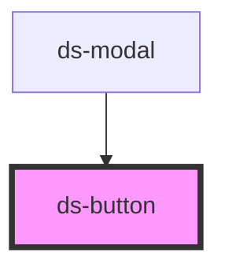

# ds-button

<!-- Auto Generated Below -->

## Properties

| Property   | Attribute  | Description | Type                                   | Default     |
| ---------- | ---------- | ----------- | -------------------------------------- | ----------- |
| `disabled` | `disabled` |             | `boolean`                              | `false`     |
| `loading`  | `loading`  |             | `boolean`                              | `false`     |
| `size`     | `size`     |             | `"lg" \| "md" \| "sm"`                 | `"md"`      |
| `variant`  | `variant`  |             | `"danger" \| "primary" \| "secondary"` | `"primary"` |

## Dependencies

### Used by

 - [ds-modal](../ds-modal)

### Graph

----------------------------------------------

*Built with [StencilJS](https://stenciljs.com/)*
