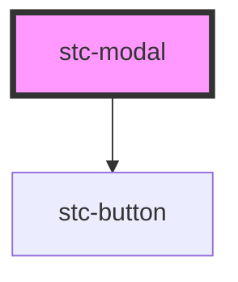

# ds-modal

<!-- Auto Generated Below -->

## Properties

| Property | Attribute | Description | Type      | Default |
| -------- | --------- | ----------- | --------- | ------- |
| `open`   | `open`    |             | `boolean` | `false` |
| `title`  | `title`   |             | `string`  | `""`    |

## Events

| Event       | Description | Type                |
| ----------- | ----------- | ------------------- |
| `stc-close` |             | `CustomEvent<void>` |

## Dependencies

### Depends on

- [stc-button](../stc-button)

### Graph

----------------------------------------------

*Built with [StencilJS](https://stenciljs.com/)*
